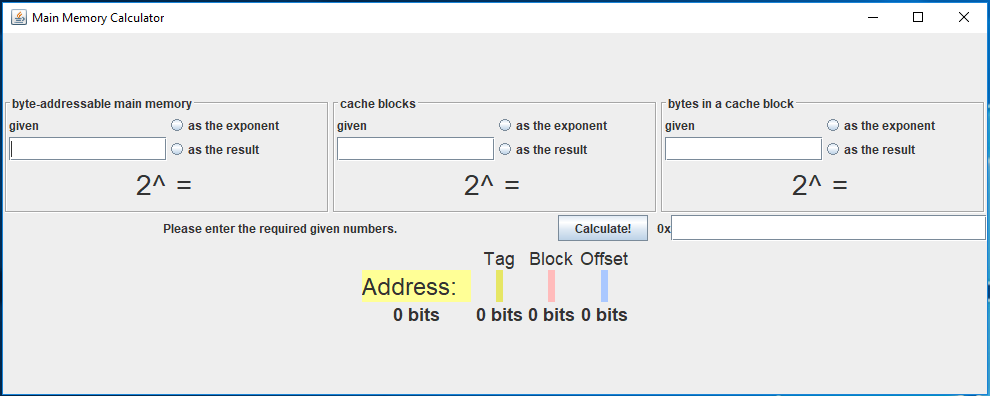
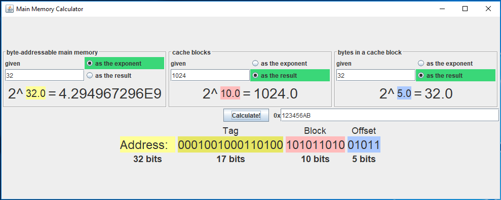
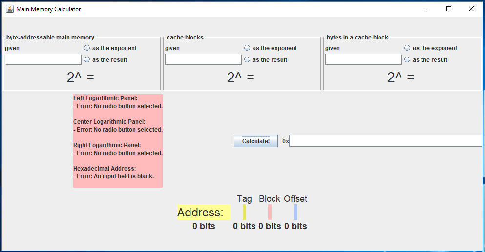

# Memory Calculator
An interactive tool for learning how to calculate computer memory addresses. Specifically for looking at how a direct-mapped cache memory address is formed given specific inputs from textbook problems. 

## Credits
**Author:** Megan O'Neill

**Originally When:** 27 March 2018 - 8 May 2018

While taking classes for
- Computer Organization
- Computer Science II

## How to run
The `memory-calculator.jar` file is an executable version of my Eclipse project. Download & run.

Initially looks like:

When proper inputs are given and the Calculate! button is pressed:

Input error messages display on Calculate! press in a red panel to the left of the Calculate! button.

## Version History
**v1.0**
I created this project as an extra "see if I could" alternative to using MS Excel as a demonstration tool. I intended to construct other address-mapping formats, but with class-graded projects happening, I only finished fully implementing direct-mapped cache. It uses basic GUI design from the Computer Science II class.